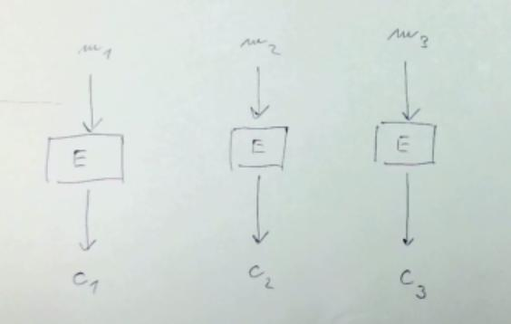
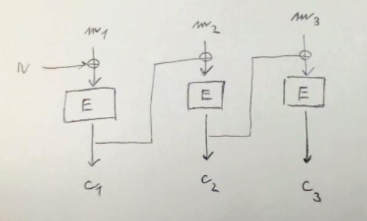
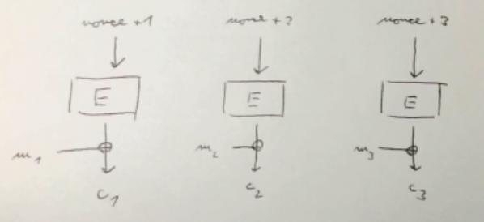
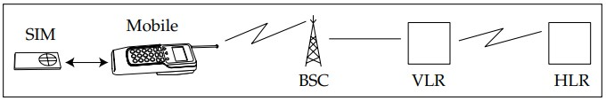

----------
## Cipher type & modes - stream, block, ECB, CBC, CTR, GCM, etc. - their strengths, weaknesses, implications on confidentiality and integrity protection. 

**Ciphertext** (šifra), **Plaintext** (text), **Keystream** (psudorandom digits šifrující plaintext, stejná vel)

*Cipher Types:*

**Stream cipher** - Překládá plaintext díl po dílu postupně. Další díl používá klíč z předchozího.
- Výhody:
    - Znemožňuje použití frekvenční analýzy.
    - Lehké na implementaci.
- Nevýhody/Slabiny:
    - Není paralyzovatelné.
    - Na konec zašifrované zprávy lze *přilepit další*.

**Block cipher** - Překládá plaintext po částech, části ciphertextu a plaintextu jsou stejné.
- Obecně je používanějsí než stream cipher
- Výhody:
    - Je paralelizovatelné
    - Vhodné pro velké soubory (např. koukání na film od konce)
- Nevýhody/Slabiny:
    - Může *prozradit strukturu* zprávy:
        - Tux the Penguin
        - Pokud ciphertext 2 bloků vyjde stejně, tak lze rozšifrovat
    - Frekveční analýza může najít velikost bloku a na menší blok lze použít brute-force.

*Modes of operation:*

**ECB** (Electronic Code Book)

- Výhody a nevýhody blokové šifry.

**CBS** (Cycle Block Chaining)

- Výhody a nevýhody blokové šifry.
- A navíc, *poslední zpráva je zranitelná manipulace převracením bitů*. Authentikace vyřeší?

Pro bezpečnost je nejlepší kombinace obou:

**GCM** (Galois Counter Mode)

- Používá *nonce* - unikátní číslo pro komunikaci
- Používá *MAC* - kontrolní součet na konci zprávy
    - (Není v obr.)
    - Zabrání lepení dalších zpráv
- Výhody:
    - stremové i blokové šifry dohromady.
    - (Nepozrazuje strukturu a lze paralerizovat)
    - Šifrování a dešifrování je téměř úplně stejné.
- Nevýhody:
    - *Zranitelná na převracení bitů kdekoliv ve zprávě*, bez použití MAC nebo HMAC

Linky:
- [Modes of Operation - Computerphile](https://www.youtube.com/watch?v=Rk0NIQfEXBA&t=2s)
- [Securing Stream Ciphers - Computerphile](https://www.youtube.com/watch?v=wlSG3pEiQdc)
- [HMAC - Computerphile](https://www.youtube.com/watch?v=wlSG3pEiQdc)

----------
## Secure communication channel set-up using combination of asymmetric and symmetric cryptography primitives: authenticating the other party, protecting confidentiality and integrity. 

RSA, Diffie-Hellmann, viz MKR

Linky:
- [AES Explained - Computerphile](https://www.youtube.com/watch?v=O4xNJsjtN6E)
- [128 bit or 256 bit Encryption - Computerphile](https://www.youtube.com/watch?v=pgzWxOtk1zg)
- [Key Exchange Problems - Computerphile](https://www.youtube.com/watch?v=vsXMMT2CqqE)
- [Secret Key Exchange (Diffie Helmann) - Computerphile](https://www.youtube.com/watch?v=NmM9HA2MQGI)
- [Diffie Hellman - the Mathematics bit - Computerphile](https://www.youtube.com/watch?v=Yjrfm_oRO0w)
- [Password Cracking - Computerphile](https://www.youtube.com/watch?v=7U-RbOKanYs)

----------
## Authentication and authorisation using symmetric cryptography primitives - NeedhamScroeder, Kerberos, authentication protocols and systems in mobile telephony: GSM, 3G, LTE authentication principles and protocols.

Umožňuje navázat spojení bez public key a hesla.
Symentrické šifrování obecně robustní proti quatovým počítačům. *Proč?*

3 instance: A, B, S kdeA věří S, B věří S, ale A nevěří B => Chceme protokol pro vytvoření transitivity

**Kerberos**
Princip:
1. A -> S: `A, B`
2. S -> A: `K_AS(A, B, K_AB, t), K_BS(A, B, K_AB, t)`
3. A -> B: `K_BS(A, B, K_AB, t)`
4. A -> B: `K_AB(m)`
`m` - zpráva, `t` - timestamp, může být nonce, může se použít `t+1` pro ověření, že B rozumí A.

Nevýhody:
- *Zranitelné vůči mitm útoku*, třeba E se předstrčí před A. To řeší:

**NeedhamScroeder**
- Princip:
1. A -> S: `A, B, N_A`
2. S -> A: `K_AS(N_A, B, K_AB, K_BS(A, K_AB))`
3. A -> B: `K_BS(A, K_AB)` *<-- nemá časovou značku* \*
4. B -> A: `K_AB(N_B)`
5. A -> B: `K_AB(N_B - 1)`
Poslední 2 zprávy potvrzují pro B, že A rozumí B v reálném čase.
\* Zranitelnost pro *masivní předvýrobu* mnoha `K_AB` klíčů.

**Moderní Kerberos**
- Princip:
1. A -> S: `A, B`
2. S -> A: `K_AS(t_S, l, B, K_BS(t_S, l, K_AB, A))`
3. A -> B: `K_BS(t_S, l, K_AB, A), K_AB(A, t_A)`
4. B -> A: `K_AB(t_A + 1)`
`t_S, t_A` - timestampy, `l` - čas expirace

Nevýhody:
- *Mimikatz* - Windows dostanou po připojení do sítě dávku autentikačních tokenů, aby se nemusely při každém připojování znovu získávat. Mimikatz ukradnou dávku hashů z paměti.
    - Může získat admin práva.
    - Zrušení cache tokenů zvýší latenci.

Linky:
- [Taming Cerberos - Computerphile](https://www.youtube.com/watch?v=qW361k3-BtU)
- [Krack Attacks - Computerphile](https://www.youtube.com/watch?v=mYtvjijATa4)

**Telekomunikace**
- Ze zvukového záznamu stačí cca 15 % dat k rozeznání informace.

1G
- Analogový přenos zvuku.
- Hlavní nevýhody
    - *Intercept* - 1. lze odposlouchávat hovor jako rádio, 2. někdo může odposlouchávat ID telefonu a pak si ID zkopírovat.
    - Vysoká cena od operátora.

**GSM (2G)**
- *Interoperability* -> Telefon - Vysílač - Ústředna -> všechny 3 lze používat nezávisle na operátorovi.
    - Snižuje cenu a umožňuje to používat běžnými lidmi, zlevnění 10x-100x
    - Umožňuje *Roaming*.
    - *Density* - nastavitelná velikost buňky.
- *SIM card* - zabezpečený čipový počítač
    - Vlastněna operátorem.
    - *Tamper Resistant* - není triviální ji zvenčí změnit.
    - *Tamper Evident* - pokud je změněna, lze to jednoduše poznat.

Připojení do sítě

- HLR - Databáze obsahující IMSI, MSIDSN, poslední lokaci.
    - Pro každého uživatele má {IMSI: Master key}
- VLR - Předvrstva HLR k minimalizování requentů na HLR.
- IMSI - mezinárodní identifikační číslo uživatele v síti, vč. země, operátora, osoby, příslušného VLR.
1. Telefon pošle: Connection Request + IMSI
2. Přes IMSI se najde příslušný operátor a request putuje až k HLR.
3. Operátor najde Master key, odvodí K_i vygeneruje RAND, vytvoří algoritmem XRES, K_C. (RAND, XRES, K_C) tvoří triplet.
4. Operátor pošle zpět triplet k VLR.
5. Od VLR se vrací do SIM jen RAND.
6. V SIM se zná K_i a dostalo se RAND, a tak z toho se spočte XRES, K_C.
7. SIM pošle XRES do VLR. Pokud se XRESs rovnají, pak lze otevřít šifrovaný kanál klíčem K_C.
- Slabiny:
    - Operátor má plnou moc nad komunikací.
    - Algoritmy pro kódování XRES byly utajované - možnost implementačních chyb.
    - "Agáta" (IMSI Catcher) - MitM útok - lze vložit BSC se silnějším signálem k telefonu a pak přeposílat traffic.
    - Downgrade útok - fake vysílač řekne, že umí jen A5/0 šifrování nebo lehkou A5/2
    - Není Perfect Forward Secrecy - Agáta pošle zpět znovu předtím zaznamenaný RAND, SIM vrátí spojení zašifrované (stejné) K_C, což lze snadno rozšifrovat.

- *Non-repudiation* - zadání PIN identifikuje uživatele (a přenáší na něj odpovědnost, když mu někdo provolá kredit)
- Streamová šifra s klíčem K_C šifruje hovor a nelze jednoduše odposlechnout. Ale kvůli utajení se zachovaly chyby.
    - A5/0 - žádné šifrování
    - A5/1 - zastaralý, dříve použito EU
    - A5/2 - slabý, použito později EU a USA, dříve i v Africe. Lze prolomit s GPU.
    - A5/3 - moderní stremová šifra. Tím se šifruje.

**3G**

Změny:
- Šifra - A5/3 (Katan), není známá triviální slabina
    - Hlídá se downgrade útok.
- Integrity Protection
    - Přidána autentifikace a MAC
    - Nepoužívají se podpisy s veřejným klíčem, ale korespondence counterů v SIM a HLR.
- Šifrování rozšířeno více k jádru sítě.

**LTE**

Revolte útok
- Využívá zranitelnosti, že streamová šifra nepoužívá IV (inicializační vektor)
- 2 po sobě jdoucí hovory mohou mít stejný IV, a tak nastane KS1 xor M1 xor KS1 xor M2 = M1 xor M2
- Když se jeden hovor podvrhne, M1 xor M2 xor M2 = M1

----------
## TLS protocol, its motivation, evolution, weaknesses and attacks, differences between the version 1.2 and 1.3.

(TLS 1.1)
- Je to fork SSL
- Pro HTTPS vyvynul Netscape a vydal zdarma, aby to někdo jiný nezpeněžil.
- Založené na streamové šifře.
- Hodně bugů,  používali pouze checksumy, citlivé na replay, mitm, ... utoky.
- Nebyl veřejně nasazen.

**TLS 1.2**

Basics
- Na pomezí TCP a HTTP (aplikační vrstvy) -> obaluje TCP
- Co chce:
    - ***Rychle** navázat end-to-end šifrované spojení mezi 2 stroji.*
    - Domluvit společný typ šifrování
    - Vymněnit klíče
    - Authentikace serveru
    - Být robustní proti mitm, etc. útokům
- Jak číst `TLS_ECDHE_RSA_with_AES_128_GCM_SHA256`
    - `ECDHE` - elliptic curve Diffie-Helmann key exchange
    - `RSA` - public key cryptosystem
    - `AES128` - cipher for data
    - `GCM` - mode of operation for data
    - `SHA256` - hash function

Handshake
1.  C -> S: `Versions`, **`N_C`**, `SessionId`, `CipherSuites`
    - Negotiation
2.  S -> C: `Version`, **`N_S`**, `SessionId`, `CipherSuite`, `Cert_S`, `[Root CAs]`
    - Server Certificate
3.  C -> S: `[Cert C]`, `K_S(pre_master_secret)`, `[Sign_C(all previous messages including)]`, `ChangeCipherSpec`, `MAC_SK("client finished", all previous messages)`
    - RSA Encryption of key material
4.  S -> C: `ChangeCipherSpec`, `MAC_SK("server finished", all previous messages)`
    - Key confirmation

-   `E_S` = RSA encryption (PKCS #1 v1.5) with S’s public key from `Cert_S`
-   `pre_master_secret` = random byte string chosen by C
-   `master_secret` = `h(pre_master_secret, "master secret", N_C , N_S)`

Security Properties
-   Secret, Fresh session key -> Yes. If client and server are trusted.
-   Mutual or One-way authentication -> Mostly one-way.
-   Entity authentication, key confirmation -> Yes (key). MAC messages confirms.
-   Perfect forward secrecy (PFS) - No.
-   Contributory key exchange - Yes. Master secret is composed of `N_C` and `N_S`
-   Downgrading protection - Yes. MAC confirms previous messages, attacker cannot put deprecated version.
-   Identity protection - No. If client needs encryption, then its cert is leaked.
-   Non-repudiation - No.
-   Plausible deniability - Yes. If `Cert_S` is obtained and client is not required to authenticate.
-   DoS resistance - Complicated.

**TLS 1.3**

Handshake:
1.  C -> S: **`N_C`**, **`g^x`**, `supported_versions`, `supported_groups`, `signature_algorithms`, `cipher_suites`, `server_name`, `certificate_authorities`
    - Parameter Negotiation (supported sign. algs., cert. authorities, target server)
    - Key Exchange (send key)
2.  S -> C: **`N_S`**, `version`, `cipher_suite`, **`g^y`**, `K_S(EncryptedExtensions, Cert_S, Sign_S(TH), HMAC_K_fkS(TH))`
    - Server Authentication (send key, certificate, cert. verification, finished, (data))
3.  C -> S: `K_C(*Cert_C, Sign_C(TH),* HMAC_K_fkC(TH))`
    - Key Confirmation, Finished
    - Nemusí se posílat `*Cert_C, Sign_C(TH),*`, pokud nechceme autentikovat klienta.
4.  Encrypted data transmittion

- **`N_C`**, **`N_S`** - nonces, zabraňují replay útokům
- TH = **transcript hash** - hash všech předchozích zpráv, zabraňují mitm a tampering útokům
- `Cert_S, Sign_S(TH)` - certifikát serveru s podpisem, autentikují server
    1. Server pomocí private key zašifruje TH, dostane `Sign(TH)` a odešle.
    2. Client použije public key serveru a rozšifruje. Pokud se TH a rozšifrovaný TH neshodují, konec.
-   `K_S`, `K_C`, `K_fkC` `K_fkS` = exchange keys, `K_Cats`, `K_Sats` = session keys; oba odvozeny z  **`g^(xy)`**
    - => Diffie-Hellman with **handshake encrypted for privacy** + **HMAC against misbiniding attack**
- HMAC (key-hashed message authentication code)
    - MAC - nějakou funkcí vytvoří kód, kterým ověřuje zprávu. *(Používá TLS 1.2)*
    - HMAC - nějakou hashovací funkcí s klíčem vytvoří kód, kterým obvěřuje zprávu. *(Používá TLS 1.3)*
- Supports *Perfect Forward Secrecy* (ephemeral diffie-hellman)

Complexity
-   **Navázání stojí 1 roundtrip** -> Data are sent since 4th message (can be also 2nd).
-   Problem: TCP is used => 2 or 3 roundtrips
    -   Google defines QUIC, runs over UDP.

Security Properties
-   Secret, Fresh session key -> Yes.
-   Mutual or One-way authentication -> One-way (only server autheticates) usually
-   Entity authentication, key confirmation -> Key yes (`K_fks` for HMAC), if also client authenticates, entity authentication yes
-   *Perfect forward secrecy (PFS)* - Yes, TLS requires Ephemeral Diffie-Hellman.
-   Contributory key exchange - Yes, both sides provide exponent and there are nonces.
-   Downgrading protection - Yes, attacker cannot modify alg., because of THs.
-   *Identity protection* - Server leaked, client sends server name in the hello; Client yes.
-   Non-repudiation - No, there is no time info.
-   Plausible deniability - No.
-   DoS resistance - Complicated.

Linky:
- [TLS - Computerphile](https://www.youtube.com/watch?v=0TLDTodL7Lc)
- [TLS Handshake Explained - Computerhile](https://www.youtube.com/watch?v=86cQJ0MMses)
- [Digital Signatures - Computerphile](https://www.youtube.com/watch?v=s22eJ1eVLTU)

----------
## Blockchain and Bitcoin principles - Private key, address, transaction, block, blockchain, mining, transaction verification.

**Elliptic curves** - EC DSA
$$y^2 = x^3 + ax + b ~\text{mod}~p$$
Operace:
- Sčítání: protne přímkou (P, Q), najde třetí bod a od něj kolmicí na osu x "vyzrcadlí" součet
- Násobení: sečte bod sám se sebou n-krát
    - Sčítání R+R je provedeno tečnou v bodě R.

Bod v nekonečnu:
- Bod, kdy x=0 a y=? 
- Musí se dodefinovat, protože sčítání sám se sebou neprotne 3 body
- Diskretizace EC ho může oddělat.

**Podpis**

Potřebné parametry:
- Křivka: $a=0$, $b=7$, $p=2^{256}-2^{32}-2^9-2^8-2^6-2^4-1$
- Generátor grupy: $G$
Klíče:
- $dA$ - privátní klíč, velké náhodné celé číslo, menší než p
    - Zvolí se náhodně
- $QA$ - veřejný klíč, bod na křivce
    - Spočte se jako $QA = dA * G$
- (Výpočet privátního klíče se opírá o složitost výpočtu diskrétní odmocniny.)
- $m$ - hashovaná zpráva, tu dostanu.
- $k$ - nonce, ten vygeneruju.
Generování podpisu:
1. $P = k * G ~\text{mod}~ p$
2. $R$ přiřadím x-ovou hodnotu $P$ 
3. Podpis je $S = (m + dA * R) * k^{-1} ~\text{mod}~ p$
    - $dA * R$ chrání před chosen message, opakováním, atd. útoky na odhalení $dA$
4. Podpis je dvojice $(R, S)$, každý má 20 Bytů.

**Blockchain**

Adresa
- Odvozena z $QA$, jako $\text{RIP160}(\text{SHA256}(QA))$ (nepřímo odvozena z privátního $dA$)
- Vlastnictví privátního klíče umožňuje transakci kryptoměny.
- Celkové množství kryptoměny je dáno počtem privátních klíčů k odemčení předchozích transakcí.

Peněženka
- Způsob uložení privátního klíče a související adresy.
- Svěření klíčů uživatelům už dovedlo k zamrznutí cca 40 % bitcoinu.
- Řeší passphrase, key-derivation-function (KDF) to převede na master-key_1 -> $dA_1$, master-key_2 -> $dA_2$
- Ideálně si nepamatuje nic a vše generuje z passphrase

Transakce
- Hlavní princip: *vše, co do transakce vstupuje, tak z ní vystupuje*
    - Když se nevyplácí celá peněženka, jde zbytek vrátit odesílateli.
    - *Unspent (UTXO)* - zbytek nebo atomická jednotka, která může použita jako odměna pro těžaře.
    - Hodnota transakce je součet všech (inputs), které se rozešlou v jiném počtu jednotek (outputs).
- Citlivé na implementační chyby -> zbytky z chyb zůstanou - unspent a není proti tomu ochrana.
- Komplikované transakce (odemčení velkého počtu malých transakcí) vyžadují větší odměnu.
- Nejmenší jednotka pro bitcoin = 10^-8 -> Satoshi

Odemykání transakce - jazykem *Script*
- Není Turing-complete
- K vykonání stačí jen stack:
    - `Unlocking Script | Locking Script` -> pokud celkové vyhodnocení skončí `True`, transakci lze vykonat.
    1. Unlocking vrátí stav stacku.
    2. Stav stacku se předlepí pro Locking a spustí se dohromady.
    - To kombinuje cizí a vlastní kód - lépe brání exploitům.

Řetězení bloků transakcí
- Aby šlo provést, musí blok obsahovat hash minulého bloku.
- *Merkle hash* - hashovaní transakcí v bloku přes BST umožňuje verifikovat transakci v logaritmickém čase (když použijeme hashe z minulého)
    - Vcelku oveřují integritu bloku.

Mining
- Umožňují decentralizaci
- Bezpečnost stojí na obtížnosti prolomení merkle hashe bloku - stojí hodně elektřiny.
- Mineři demokraticky rozhodují, která transakce jde do jakého bloku, přes 51% většinu.

Linky:
- [The Blockchain & Bitcoin - Computerphile](https://www.youtube.com/watch?v=qcuc3rgwZAE) (hodně povrchní)
- [How does actually bitcoin work? - 3Blue1Brown](https://www.youtube.com/watch?v=bBC-nXj3Ng4)
- [Bitcoin Mining in 4 Minutes - Computerphile](https://www.youtube.com/watch?v=wTC31ZI6QM4)
- [Crypto-jacking - Computerphile](https://www.youtube.com/watch?v=vMIZKtVruH8)