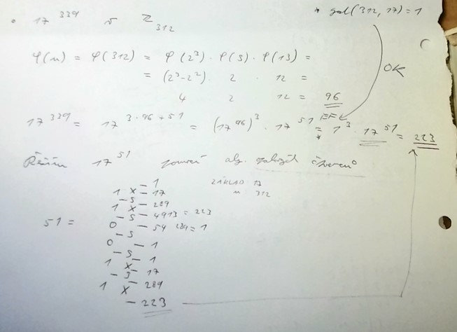
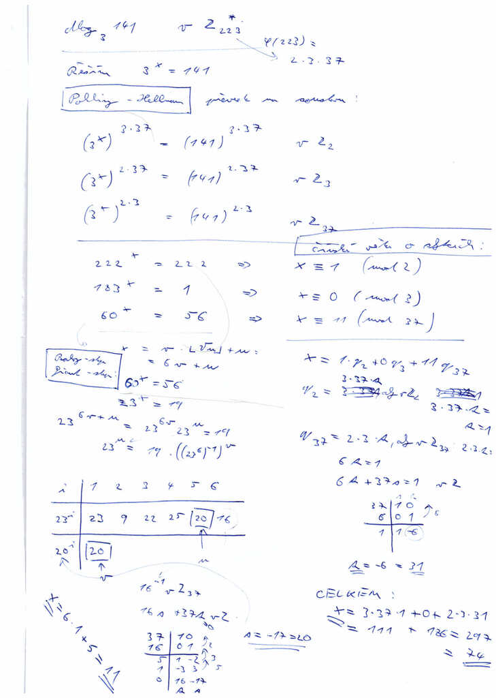

----------
## RSA cryptosystem and number theory behind it (Euler theorem, Repeated squaring algorithm, the Chinese remainder theorem). Attacks on RSA cryptosystem.

**Euler theorem**
- Malá fermatova věta: $a^{p-1} = 1 ~(\text{mod}~p)$, pro $\forall a \neq kp$, $p$ je prvočíslo
- Euler-Fermatova věta (EF): $a^{\varphi(n)} = 1$ v $\mathbb{Z}_n$, *pokud $a$ je nesoudělné s $n$ ($\text{gcd}(a,n) = 1$)*
- Eulerova funkce $\varphi$ je počet čísel v $[0, n-1]$ nesoudělných s $n$ a platí:
    - $\varphi(p) = p-1$
    - $\varphi(p^k) = p^k - p^{k-1}$
    - $\varphi(m \cdot n) = \varphi({m}) \cdot \varphi({n})$

**Algoritmus opakovaných čtverců**
- Umožňuje počítat velké mocniny postupně, jako EF. Nemá podmínky pro základ.
- Např. v $Z_{20}$ je $2^{13} = (((1 \times 2)^2 \times 2 )^2)^2 \times 2$, čehož se prakticky docílí takto:
    - $13 = 1101_2$
    - Budeme 3-krát mocnit (3 mezery v binárním zápisu).
    - Kde je 1, tam se násobí základem, a tak vznikne:
    - XSXSSX
    - 1 X 2 S 4 X 8 S 64 = 4 S 16 X 32 = 12

Dohromady jdou EF a opakované čtverce použít jako:


**RSA**

Vytvoření klíče:
1. A zvolí $p$, $q$, různá prvočísla. Spočte $n = p \cdot q$, $\varphi(n) = (p-1)(q-1)$.
2. A zvolí $e$, pro které existuje $d = e^{-1}$, spočte si $d$.
3. Vznikl public key: $(n, e)$, private key: $(n,d)$ pro A.
*Aby bylo $e$ invertibilní, musí být $\text{gcd}(e, \varphi(n)) = 1$*

Poslání zprávy: (B posílá A zprávu)
1. B zná public key od A: $(n, e)$.
2. B spočte $b = a^e$ v $\mathbb{Z}_n$.
3. B pošle A ciphertext $b$.
4. A rozšifruje $b$ jako $a = b^d$ v $\mathbb{Z}_n$.

Věta:
- pokud  $n = p \cdot q$, $\varphi(n) = (p-1)(q-1)$, $e \cdot d = 1$ v $\mathbb{Z}_{\varphi(n)}$,
- pak $\forall a \in \mathbb{Z}_n$ platí: $a^{e \cdot d} = 1$ v  $\mathbb{Z}_n$.
Důkaz: $a^{e \cdot d} = a^{1 + k\varphi(n)} = a^1 \cdot 1 = a$
- První rovnost $e \cdot d = 1 + k\varphi(n)$ vychází z $e \cdot d = 1$ v $\mathbb{Z}_{\varphi(n)}$
- Druhá rovnost lze použít z EF.
- Pokud je $a$ soudělná s $n$, nelze použít EF. To se vyřeší čínskou větou o zbytcích:
    - $\mathbb{Z}_n \sim \mathbb{Z}_p \times \mathbb{Z}_q$ 
    - $a \sim (a_p, a_q)$
    - Vyřeší se stejný problém extra pro $a_p$ v $\mathbb{Z}_p$ a pro $a_q$ v $\mathbb{Z}_q$ 

**Čínská věta o zbytcích**
- Soustava rovnic $x = a_i ~\text(mod)~ n_i$, kde $a_i \in \mathbb{N}$ a *$n_i$ jsou po 2 nesoudělná*, má řešení.
- Viz Druhá část v [příkladu na Pohling-Hellmanův algoritmus](mkr#Discrete logarithm problem and its use in cryptography. Baby step-giant step algorithm, Pohling-Hellman algorithm and a subexponential algorithm for discrete logarithm - basic ideas of their principles and time complexity.).

**Útoky na RSA**

Brute-force
1. Faktorizuje $n = p \cdot q$
2. Spočte $\varphi(n) = (p-1)(q-1)$
3. Spočte $d$ jako $e \cdot d = 1$ v $\mathbb{Z}_{\varphi(n)}$.

Insider útok
- Slabina: 2 šifry používají stejné $n$.
- Útočník zná $(n,e_1)$, $(n,d_1)$, $(n,e_2)$.
1. Z netriviální $\sqrt{1} = b$ lze získat faktor $n$ jako $\text{gcd}(b \pm 1, n)$
2. Odmocninu lze spočítat z rovnice $a^{e_1 \cdot d_1} = 1$
3. Tipne se $a = 2$ a zkouší se mocnit a pak čtvercovat. Pokud kdekoliv v čtvercování vyjde 1, je nalezena netriviální odmocnina.
4. Pokud nevyjde 1, zkusí se větší $a$ a jde se na předchozí krok.

Outsider útok
- Slabina: 2 šifry používají stejné $n$.
- Útočník zná $(n,e_1)$, $(n,e_2)$, $b_1$, $b_2$
    - (Osoba 1 a osoba 2 dostali stejnou zprávu.)
- Útočník chce rozšifrovat zprávu $a$.
1. Z Bezoutovy věty existují $s$, $t$, že $1 = e_1 \cdot s + e_2 \cdot t$ -> Euklidovým algoritem najde $s$, $t$.
2. Zpráva se rozšifruje $a^1 = a^{e_1 \cdot s + e_2 \cdot t} = b_1^s \cdot b_2^t$

Hastadův útok
- Slabina: Šifry používají stejné $e$.
- Útočník zná $(n_1,e), (n_2,e), \dots, (n_k,e)$, $b_1, b_2, \dots, b_k$.
- Přes čínskou větu o zbytcích spočte $x = a^e$ v $\mathbb{Z}_{n_1 \cdot n_2 \dots n_k}$ jako $x = b_i ~\text{mod}~n_i$ pro $i = 1, \dots, k$

Wienerův útok
- Pokud je $d$ malé, lze aproximovat přes konvertgentu (utrhnutí řetězového zlomku).
- Matematicky je celkem komplikovaný. Tomuto se u státnic vyhnout.

-----------
## Diffie-Hellman key exchange, El-Gamal cryptosystem and group theory behind it (cyclic groups, finding a generator, which groups Z ∗ n are cyclic?).

**Cyklické grupy**
- Grupa $G$ je cyklická, pokud pro nějaký prvek $a \in G: G = <a>$
- $<a>$ je řád cyklické podgrupy.
- Řád prvku je nejmenší $r > 0$, pro nějž platí: $a^r = 1$ v grupě $(G, \cdot)$.
- Příklady:
    - $\mathbb{Z}^*_9$ je cyklická, protože $\varphi(9) = 6$, má prvky $\{1,2,4,5,7,8\}$, $G = <2>$, protože $r(2) = 6$
    - $\mathbb{Z}^*_8$ není cyklická, protože $\varphi(8) = 4$, má prvky $\{\pm 1, \pm 3\}$, ale $3^2 = 1$ zkolabuje a další prvek už není.
- Obecně cyklické grupy:
    - $\mathbb{Z}^*_p$, pokud je prvočislo $p$ liché.
    - $\mathbb{Z}^*_n$, kde $n$ je dělitelné alespoň 2 různými prvočísly.
    - $\mathbb{Z}^*_{p^e}$, pokud je prvočislo $p$ liché a $e \geq 1, e \in \mathbb{N}$.

**Diffie-Hellman**

Vytvoření klíče:
1. A zvolí cyklickou grupu $G$ řádu $n$, zvolí $x \in \mathbb{Z}_n$. Spočte $b = a^x$ v grupě $G$. Pošle $a, b, G, n$.
2. B zvolí $y \in \mathbb{Z}_n$. Spočte $s = b^y$, $c = a^y$ v grupě $G$. Pošle $c$.
3. A spočte $s = c^x$ v grupě $G$.

Bezpečnost DH se opírá o složitost výpočtu diskrétního logaritmu:
- $x = ~?: b = a^x$

**El-Gamal**
- Umožňuje posílat se sdíleným klíčem zprávy.
- Je pomalý, protože provádí mocnění pro každou zprávu.

Poslání zprávy: (B posílá A zprávu)
- B už dostal $a, b, G, n$.
- B chce poslat zprávu $m$.
1. B zvolí $y \in \mathbb{Z}_n$.  Spočte $s = b^y$, $c = a^y$, $\hat{m} = m \cdot s$ v grupě $G$. Pošle $c, \hat{m}$.
2. A spočte $s^{-1} = c^{n-x}$ v grupě $G$. Dešifruje zpávu $m = \hat{m} \cdot s^{-1}$ v grupě $G$.
(Počítat $c^{n-x}$ stačí, protože v exponent je v $\mathbb{Z}_n$, a tak $c^{-x} = c^{n-x}$.)

-----------
## Primes and their properties, generating random primes. Probabilistic primality testing, Fermat test, Miller-Rabin test - basic principles and error probability.

**Prvočísla**
- Nekonečně mnoho.
- Každé složené číslo má unikátní faktorizaci (základní věta aritmetiky).

**Generování prvočísel**
```python pseudocode
def getRandomPrime(l, h):
    n = sample(l, h);
    while not isPrime(n);
        n = sample(l, h);
    return n;
```
- `isPrime` je test prvočíslenosti.

**Fermatův test**
- Používá malou Fermatovu větu: $a^{p-1} = 1$ v $\mathbb{Z}_p$ pro $\forall a \in \mathbb{Z}_n^*$.
1. Test dostane $n$ - číslo k otestování, $k$ - počet testů 
2. $k$-krát sampluje $a$ v $\mathbb{Z}_n$, pak testuje že $a^{n-1} = 1$, pokud kdykoliv neplatí, pak $n$ není prvočíslo.
- Hlavní pastí jsou *Carmichaelova čísla* - nesoudělná s $n$, ale $a^{n-1} = 1$ v $\mathbb{Z}_n$.
- Pravděpodobnost chyby:
    - Lze spočítat jako $\frac{K_n}{\varphi(n)}$, kde $K_n = \{a \in \mathbb{Z}_n^*; a^{n-1} = 1\}$
    - Obecně je $1/2^{\#a}$

**Miller-Rabinův test**
- Od Fermatova testu navíc testuje, že při umocnění světka nevznikne netriviální $\sqrt{1}$.
    - Když čtvercování narazí na -1, může být $p$ prvočíslem.
    - Když čtvercování narazí na 1, není $p$ prvočíslem.
- Pravděpodobnost chyby:
    - Lze spočítat jako $\frac{L_n}{\varphi(n)}$, kde $L_n = \{a \in \mathbb{Z}_n^*; a^{n-1} = 1 \land \text{jeho čtverce nevygenerují} \sqrt{1}\}$
    - Obecně je $1/4^{\#a}$

-----------
## Discrete logarithm problem and its use in cryptography. Baby step-giant step algorithm, Pohling-Hellman algorithm and a subexponential algorithm for discrete logarithm - basic ideas of their principles and time complexity.

Diskrétní logaritmus
- Řeší rovnici $b^x = a$ v $\mathbb{Z}_n^*$. Značí se jako $x = \text{dlog}_b(a)$.
- Používá se pro bezpečnost Diffie-Hellman výměny klíče. Není znám polynomiální algoritmus (neví se, zda je to vůbec NP-complete).

**Baby step-giant step algoritmus**
- Rozloží $x = u + v \cdot \lfloor\sqrt{n}\rfloor$
- Zkouší, pro jaké $u, v$ platí: $b^u = a \cdot b^{-v \cdot \lfloor\sqrt{n}\rfloor}$ (pravou stranu většinou není nutné celou spočítat až do $\lfloor\sqrt{n}\rfloor$)
- Pokud se logaritmus nepočítá v $\mathbb{Z}_p^*$, ale v $\mathbb{Z}_n^*$ musí se počítat residuálně přes čínskou větu o zbytcích.

**Pohling-Hellman algoritmus**
- Pro každý faktor $\varphi(n)$ vynásobí obě strany rovnice $\frac{\varphi(n)}{p_i^{e_i}}$.
- Podle faktorů řeší residuálně rovnici: $(a^x)^{\frac{\varphi(n)}{p_i^{e_i}}} = b^{\frac{\varphi(n)}{p_i^{e_i}}}$ (čínská věta o zbytcích)
- 

**SEDL** (bez detailů)
- $y$-hladké číslo $m$ je každé přirozené číslo, jehož všechna prvočísla dělí $m$ a jsou menší rovna $y$.
    - $y$ je parametr algoritmu.
1. Náhodnou volbou najde $(k+1)$ $y$-hladkých čísel ze $\mathbb{Z}_p^*$ tvaru $a^{s_i} b^{t_i} h_i = p_i^{v_i^{(1)}} \dots p_k^{v_i^{(k)}}$ pro $i = 1, \dots, k+1$.
    - $k$ je počet prvočísel do $y$.
    - $\boldsymbol{s}, \boldsymbol{t}$ utvoří vektory, $\boldsymbol{V} \in \mathbb{N}^{k \times (k+1)}$ je matice $k$-tic expoenetů.
2. Najde nějaké $\boldsymbol{c}$, pro které platí: $\boldsymbol{V} \boldsymbol{c} = \boldsymbol{0}$. Pak spočte $s = \boldsymbol{s}^{\top}\boldsymbol{c}$, $t =\boldsymbol{t}^{\top}\boldsymbol{c}$.
    - Počítá nad tělesem $\mathbb{Z}_q$, kde $q = |G|$ (prvočíslo), je množina $(k+1)$ vektorů lineárně závislá.
    - $a^{s} b^{t} = 1$ tvoří representaci prvku 1 v $G \subseteq \mathbb{Z}_p^*$.
3. $\text{dlog}_a(b) = -st$, pokud $t = 0$, pak algoritmus vrátí "neúspěch".
    - Spočte se jako $1 = a^{s} b^{t} = a^{s} (a^{x})^{t} \implies 0 = s+tx$.
    - Logaritmus počítá nad $\mathbb{Z}_p^*$, exponent počítá nad $\mathbb{Z}_q$.

-----------
## Number factorisation problem and its use in cryptography. A subexponential algorithm for factorisation, Quadratic sieve algorithm - basic ideas of their principles and time complexity.

**Faktorizace**
- Rozklad čísla na součin mocnin různých prvočísel.
- Existuje pro každé přirozené číslo (základní věta aritmetiky).
- Není znám polynomiální algoritmus na řešení faktorizace (nevím, zda je to vůbec alespoň NP-complete).
- Využívá to bezpečnost RSA šifrování.

**Faktorizace přes $\varphi(n)$**
- Víme $n, \varphi(n)$.
- Je rozumné předpokládat, že je to součin 2 prvočísel, jinak by to šlo rozložit přes čínskou větu a počítat na menších modulech.
    - $n = pq$
    - $\varphi(n) = (p-1)(q-1) = pq - p - q + q = n -(p+q) = \varphi(n) \implies p+q = n - \varphi(n)$
- Z vietova vzorce spočítá rovnici $x^2 + bx + c = 0$ tak, že:
    - $b = -(p+q) = \varphi(n) - n$
    - $c = pq = n$
- Rovnice má 2 řešení, kterými jsou faktory $n$.

**SEF** (bez detailů)
- Dostane parametr $y$, podobně, jako SEDL
1. Náhodnou volbou $a_i$ najde $(k+1)$ čtverců $a_i^2 = p_i^{v_i^{(1)}} \dots p_k^{v_i^{(k)}}$
    - $k$ je počet prvočísel do $y$, $\boldsymbol{V} \in \mathbb{N}^{k \times (k+1)}$ je matice $k$-tic exponentů.
2. Najde nějaké $\boldsymbol{c}$, pro které platí: $\boldsymbol{V} \boldsymbol{c} = \boldsymbol{0}$.
    - Počítá nad $\mathbb{Z}_2$.
3.  Spočítá $c = a \cdot b^{-1} = \prod_{i=1}^{k+1} a_i^{c_i} \cdot \left(\prod_{i=1}^{k+1} p_i^{\frac{e_i}{2}}\right)^{-1}$, faktorizace $n = \prod \text{gcd}(c \pm 1, n)$, pokud $c = \pm 1$, hlásí "neúspěch".
    - Počítá nad $\mathbb{Z}_n^*$.
    - $c$ může spočítat z rovnosti $a^2 = b^2$.

**Kvadratické síto**
- Vylepšuje SEF tím, že v prvním kroku nehledá čtverce náhodně.
- Dostane 2 parametry: $y$, $z$ ($z$ se volí nějak heuristicky, pokud je moc malé, nemusí se najít nic).
- Hledá $y$-hladká čísla na polynomu $F(x) = (x+m)^2 - n$ v rozsahu $F(x) = 1, \dots, z$, určí $m = \lfloor \sqrt{n} \rfloor$.
    - Pokud je $F(x)$ $y$-hladké číslo, pak je to $y$-hladký čtverec.
- Zrychlení se dosáhne tím, že
    - $F(x)$ se dělí jen příslušnými prvočísly.
    - $y$-hladkost lze ověřit "najednou", pro vybrané prvočíslo všechny hodnoty polynomu $1, \dots, z$.

-----------
## Elliptic Curve Cryptography - Diffie-Hellman key exchange and El-Gamal cryptosystem using an elliptic curve group. Elliptic curve discrete logarithm problem and Baby step-giant step algorithm.

Short story:
- Stačí definovat křivku a operaci sčítání. Viz. [[kbe#Blockchain and Bitcoin principles - Private key, address, transaction, block, blockchain, mining, transaction verification.]]
- Mocnění funguje jako násobení.
- V eliptických křivkách nejsou definovány pro subexeponenciální algoritmy.
