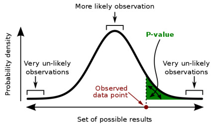
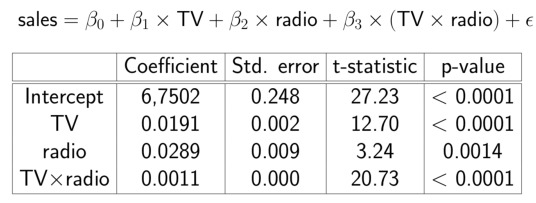
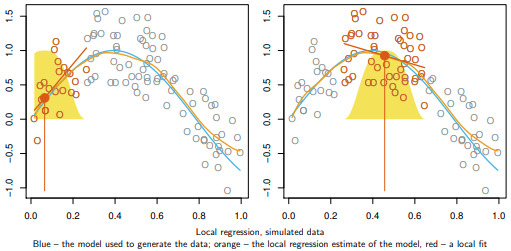
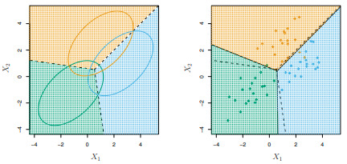
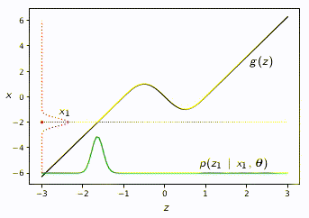
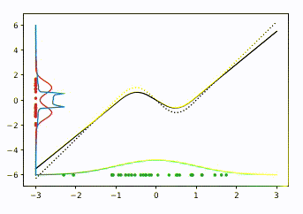
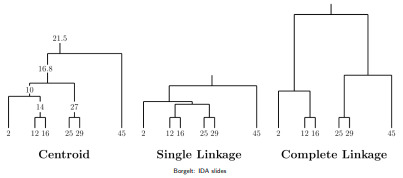

----------
## *SAN Minimum*

- *Aritmetický průměr* - průměrná hodnota mezi seznamem čísel.
- *Střední hodnota* - je vážený průměr, suma všech hodnot náhodné veličiny povážené jejich pravděpodobností.
- *Kovariance* - měří lineární závislost dvou náhodných veličin.
    - nabývá intervalu $(-\infty, \infty)$
    - $cov(X,Y) = corr(X,Y) \cdot std(X) \cdot std(Y)$
    - $cov(X,Y) = E[(X-EX)(Y-EY)]$
- *Korelace* - měří, jak moc je dvojice náhodných proměnných na sobě
    - nabývá intervalu $[-1, 1]$
- *Distribuční funkce* - pravděpodobnost, že náhodná proměnná X nabývá hodnoty alespoň x, tedy $P(X \leq x)$.
- *Kvantil* - inverz distribuční funkce.
- *Confidence interval (interval spolehlivosti)* - rozsah, kde předpokládám, že nějaké pozorování padne s pravděpodobností $\alpha$.
- *Centrální limitní věta* ([M. Navara](https://cmp.felk.cvut.cz/~navara/stat/CLV_ebook.pdf))
    1. Předpokládejme náhodné veličiny $X_i$ pro $i = 1,2, \dots$, které jsou *nezávislé* a mají *stejné rozdělení*.
    2. Posloupnost náhodných veličin je definována jako $U_n = \sum_{i=1}^n X_i$ (částečné součty řady).
    3. Tvar rozdělení (pokud nás nezajímá mean-std veličiny) je normalizace náhodné veličiny: $Y_n = \text{norm} (U_n)$.
    4. CLV říká, že pro $n \to \infty$ se $Y_n$ blíží $N(0,1)$.
    5. CLV říká, že distribuční funkce konvergují k funkci normovaného normálního rozdělení $$\forall t \in \mathbb{R}: \lim_{n \to \infty} F_{Y_n}(t) = F_{N(0,1)}(t)$$
- *Studentovo t-rozdělení*
    - Pokud nevíme rozptyl chyb měření, pak to nejde odhadnout přes normální rozdělení (nevíme přece rozptyl).
    - Použijeme robustnějsí t-rozdělení, ve kterém místo toho nastavujeme *stupeň volnosti* - rostoucí stupeň volnosti se blíží normálnímu rozdělení.
    - Používá se pro test nekorelace nebo test významnosti.
- *p-value* - pravděpodobnost, že budeme pozorovat extrémější výsledek za předpokladu že platí nulová hypotéza.
    - 
- *F-test* - testuje nulovou hypotézu, že 2 nezávislé náhodné veličiny mají stejný rozptyl.
- *Likelihood*
    - *Pravěpodobnost (prior)* popisuje šanci, že budeme pozorovat data nebo jev (dané parametry), bez předchozího pozorování dat.
    - *Věrohodnost (likelihood)* popisuje pravděpodobnost, když navíc ještě pozorujeme jiná data.
- Parametrický VS Neparametrický test
    - *Parametrický* - má normální rozdělení
    - *Neparametrický* - test nepředpokládá rozdělení dat
- Závislá VS Nezávislá proměnná
    - *Nezávislá* proměnná - ovládaná proměnná $x$
    - *Závislá* proměnná - testovaná proměnná $y = f(x)$, závislá na $x$.

Druhy testů
| Nezávislá prom. \ Závislá prom. | *Kategorická prom.*                 | *Spojitá prom.*   |
| ------------------------------- | ----------------------------------- | ----------------- |
| *Kategorická prom.*             | kontingenční tabulky, $\chi^2$-test | ANOVA             |
| *Spojitá prom.*                 | LDA, logistická regrese             | korelace, regrese |

----------
## Multiple linear regression. Describe the model and its assumptions. Treatment of qualitative independent variables, collinearity and outliers. Decide whether a model is useful. Overfitting, feature selection, model regularization.

**Lineární regrese**
- Předpoklady:
    - *Linearita* - vztah mezi závislou a nezávislou proměnnou je lineární.
    - *Normalita* - šum má normální rozdělení.
    - *Homoskedacita* - rozptyl veličin je všude stejný.
- Model:
    - Modeluje náhodnou proměnnou $Y$ podle $X$ jako $Y = \beta_0 + \beta_1 X + \epsilon$
    - Odhaduje $\boldsymbol{\hat{y}}$ jako $\hat{y}_i = \hat{\beta_0} + \hat{\beta_1} x_i$
- Odhad parametrů $\beta$ se provede přes minimalizaci čtverců chyb:
    - RSS: $\sum_{i=1}^m (\hat{y}_i - y_i)^2 = \sum_{i=1}^m (\hat{y}_i - \hat{\beta_0} + \hat{\beta_1} x_i)^2$
    - *Slope* $\hat{\beta}_1 = \frac{(\boldsymbol{x}-\mu_x)^\top(\boldsymbol{y}-\mu_y)}{\sum_{i=1}^n (x_i - \mu_x)^2}$
    - *Intercept* $\hat{\beta}_0 = \mu_y - \hat{\beta}_1 \mu_x$ ... kde $\mu_x, \mu_y$ jsou průměry naměřených $x_i, y_i$.
- Další měření lineární regrese:
    - *Standardní chyba* - udává, jak se mění $\beta$ s opakovaným samplováním.
        - $SE(\hat{\beta}_1) = \frac{\sigma^2}{\sum_{i=1}^n (x_i - \mu_x)^2}$
        - $\sigma$ je rozptyl chyb. Jde odhadnout jako $RSE = \sqrt{\frac{RSS}{n-2}}$
    - *Interval spolehlivosti* je $[\hat{\beta}_1 - 2 \cdot SE(\hat{\beta}_1), \hat{\beta}_1 + 2 \cdot SE(\hat{\beta}_1)]$
    - TSS: $\sum_{i=1}^n (y_i - \mu_y)^2$
- Testování hypotézy (zda je model užitečný):
    - $H_0$: Není žádný vztah mezi X a Y, tedy, že $\beta_1 = 0$.
    - Testuje s t-rozdělením $n-2$ stupňi volnosti. Spočte $$t = \frac{\hat{\beta}_1 - 0}{SE(\hat{\beta}_1)}$$
    - Pokud je p-hodnota menší než 0.05, můžeme $H_0$ zamítnout, a tak je model užitečný.
- Typické příklady použití:
    - Závisí cena auta na jeho spotřebě?

**Víceproměnná lineární regrese**
- Model:
    - Jedna závislá proměnná $y_i = \boldsymbol{x}_i^\top \boldsymbol{\beta} + \boldsymbol{\epsilon}$
    - Dohromady: $\boldsymbol{y} = \boldsymbol{\beta}\boldsymbol{x} + \boldsymbol{\epsilon}$
    - Odhaduje $\boldsymbol{\hat{y}}$ jako $\hat{y}_i = \hat{\beta_0} + \hat{\beta_1} x_{i,1} + \dots + \hat{\beta_k} x_{i,k}$
- Parametry modelu se odhadnou podobně, jako v lineární regresi.
- Testování hypotézy (zda je model užitečný):
    - $H_0$: Žádný prediktor není užitečný, tedy, že $\beta_1 = \dots = \beta_k = 0$.
    - Testuje s F-rozdělením $k, n-k-1$ stupni volnosti. Spočte $$F = \frac{\frac{TSS - RSS}{k}}{\frac{RSS}{n-k-1}}$$ (počítá poměr mezi vysvětleným a nevysvětleným rozptylem)

Rozhodování o důležitých proměnných
- *All subsets* - naivní, čas $O(2^k)$
- *Forward stepwise selection* - začne s prázdným modelem a postupně přidává takové proměnné, které se kterými dostaneme *nejnižší RSS*.
    - Čas: $O(k^2)$
- *Backward stepwise selection* - začne s úplným modelem a postupně odebírá takové proměnné, které se kterými dostaneme *největší p-hodnotu*.
    - Čas: $O(k^2)$
    - Nelze použít, pokud $k > n$.

Kvalitativní nezávislé proměnné
- *Binární prediktory*
    - Positivní: $x_i = 1: \beta_0 + \beta_1 + \epsilon_i$
    - Negativní: $x_i = 0: \beta_0 + \epsilon_i$
- *L-úrovňové prediktory*
    - Vytvoříme L-1 proměnných.
    - $x_{i,1} = 1$ pokud $i$-tá osoba je muž, jinak $x_{i,1} = 0$
    - $x_{i,2} = 1$ pokud $i$-tá osoba pochází z Evropy, jinak $x_{i,2} = 0$
    - atd.
- *Interakce mezi proměnnými*
    - 

Výběr nejlepšího modelu (aby model neoverfitoval trénovací data)
- *Výběr z podmnožin prediktorů*
- *Redukce dimenze*
- *Regularizace*
    - **Ridge regression**: optimalizuje RSS + $\lambda \sum_{i=1}^k \hat{\beta}_i^2$
    - **Lasso**: optimalizuje RSS + $\lambda \sum_{i=1}^k |\hat{\beta}_i|$
    - $\lambda$ je (hyper)parametr, může se zvolit:
        - manuálně
        - cross-validace

----------
## Non-linear regression, polynomial regression, splines, local regression.

**Polynomiální regrese**
- Model:
    - Modeluje náhodnou proměnnou $Y$ podle $X$ jako $Y = \beta_0 + \beta_1 X + \dots + \beta_d X^d + \epsilon$
    - Odhaduje $\boldsymbol{\hat{y}}$ jako $\hat{y}_i = \hat{\beta_0} + \hat{\beta_1} x_i + \dots + \hat{\beta_d} x_i^d + \epsilon_i$
- Výhody:
    - Fitování funguje jako v lineární regresi s dalšími proměnnými.
    - Snadný výpočet.
- Nevýhody:
    - Okrajové hodnoty mají větší chybu

**Krokové funkce**
- Rozdělí nezávislou proměnnou na *uzlové body* a v meziintervalech počítá vlastní model (typicky jen slope).
- Výhody:
    - Jednoduché výpočty
- Nevýhody:
    - Určení uzlových bodů vyžaduje předchozí znalosti

**Spliny (Piecewise polynomials)**
- Používá také *uzlové body*.
- Navíc, *vyžaduje spojitost* v uzlových bodech - existuje derivace do řádu $d-1$.
- **Natural spline** - lineárně extrapoluje za uzlovými body, čímž vylepšuje nestablní okraje
- **Smoothing spline** - optimalizuje s regularizací: min $\sum_{i=1}^n (y_i - g(x_i))^2 + \lambda \int g''(t) dt$
    - Pokud $\lambda = 0$, pak overfituje, vlnitými polynomy.
    - Pokud $\lambda = \infty$, pak se $g$ stane lineární funkcí.

**Local regression**
- Po malých intervalech provede lineární regrese a pak je projezdí kernelem (asi jako konvoluce).
- 

----------
## Analýza rozptylu
(Na [OI státnicových tématech](https://oi.fel.cvut.cz/res/pages/files/17311-50-oi-master-state-exam-topics-2021-05-28.pdf) toto úplně chybí.)

**Two sample t-test**
- Předpokládá:
    - stejný rozptyl
    - stejné počty vzorků
- $H_0$: 2 populace mají normální rozdělení.
- Testuje s t-rozdělením $2n-2$ stupni volnosti: $$t = \frac{\mu_x - \mu_y}{\sqrt{\frac{\sigma_x^2 + \sigma_y^2}{n}}}$$
- Typické příklady použití:
    - Závisí pohlaví osoby na velikosti mzdy?

**Welshův t-test**
- Neparametrický test
- $H_0$: 2 populace mají normální rozdělení.
- Testuje s t-rozdělením $n_x + n_y -2$ stupni volnosti: $$t = \frac{\mu_x - \mu_y}{\sqrt{\frac{\sigma_x^2}{n_1}+\frac{\sigma_y^2}{n_2}}}$$
**ANOVA**
- Analýza rozptylu pro více než 2 skupiny.
- Pokud se provede více než 1 měření, pak použít *MANOVA*.
- Předpoklady:  -> pokud neplatí, pak použít *Kruskal-Wallis test*.
    - nezávislé vzorkování, iid
    - normální rozdělení v každé skupině
    - homoskedacita nezávisí na skupině
- $H_0: \mu_1 = \mu_2 = \dots = \mu_g$
- Typické příklady použití:
    - Závisí původ osoby (Evropa, Asie, Amerika, ...) na velikosti mzdy?

----------
## Discriminant analysis. LDA, QDA and logistic regression.

Co chce:
- Klasifikovat $f: X \to C$ nebo $f_p: X \times C \to [0,1]$
- Vysvětlit jednotlivé nezávislé proměnné.

**Logistická regrese**
- Proč použít a nepoužít lineární regresi:
    - Robustnější vůči outlierům, které mohou rozházet minimalizaci nejmenších čtverců.
    - Vrací pouze $[0,1]$.
- Úlohou je klasifikuce jako $X \to [0,1]$ (převede spojitou proměnou na pravděpodobnost mezi 2 třídami).
- Klasifikuje podle *log odds*: $\log \frac{p(0|\boldsymbol{x})}{p(1|\boldsymbol{x})} = \boldsymbol{w}^\top\boldsymbol{x}$
    1. Odlogaritmuje: $\frac{p(0|\boldsymbol{x})}{p(1|\boldsymbol{x})} = e^{\boldsymbol{w}^\top\boldsymbol{x}}$
    2. Což je: $p(0|\boldsymbol{x}) = p(1|\boldsymbol{x}) \cdot e^{\boldsymbol{w}^\top\boldsymbol{x}}$
    3. $1 = p(0|\boldsymbol{x}) + p(1|\boldsymbol{x}) = p(1|\boldsymbol{x}) \cdot e^{\boldsymbol{w}^\top\boldsymbol{x}} + p(1|\boldsymbol{x}) = p(1|\boldsymbol{x}) (1 + e^{\boldsymbol{w}^\top\boldsymbol{x}})$
    4. Klasifikuje $p(1|\boldsymbol{x}) = \frac{1}{1 + e^{\boldsymbol{w}^\top\boldsymbol{x}}},~~ p(0|\boldsymbol{x}) = \frac{1}{1 + e^{-\boldsymbol{w}^\top\boldsymbol{x}}}$
- Parametry optimalizuje jako $\boldsymbol{w}^* = \text{arg}\min_w \sum_{(\boldsymbol{x},c) \in T} \ln(1 + e^{-c\boldsymbol{w}^\top\boldsymbol{x}})$

**LDA** (Linear discriminant analysis)
- Předpoklady:
    - Každá třída má *normální rozdělení se stejným rozptylem*.
- Model kombinuje 2 věci:
    - Bayesovu větu: $p(y,x) = p(y|x) \cdot p(x) = p(x|y) \cdot p(y) = p(x,y)$
    - Gaussovo rozdělení.
- Klasifikuje jako: $$p(k|x) = \frac{p(k)\frac{1}{\sigma \sqrt{2\pi}} e^{-\frac{1}{2}(\frac{x-\mu_k}{\sigma})^2}}{\sum_{j=1}^K p(j)\frac{1}{\sigma \sqrt{2\pi}} e^{-\frac{1}{2}(\frac{x-\mu_j}{\sigma})^2}} ~\tilde{=}~ x\frac{\mu_k}{\sigma^2}-\frac{\mu_k^2}{2\sigma^2}+\ln p(k)$$
    - Rozhodovací hranice je lineární.
    - Např. pro 2 třídy s $p(1) = p(2) = 0.5$ je hranice $x = \frac{\mu_1 + \mu_2}{2}$
- 

**QDA** (Quadratic discriminant analysis)
- Rozhodovací hranice už není lineární.
- Použít, pokud mají nezávislé proměnné *odlišné kovarianční matice*.

----------
## Robust statistics. Robust estimators of location and scale, M-estimators. Robust regression. Non-parametric tests.

Snaží se mít takovou statistiku, že:
- Není ovlivněna outliery.
- Není ovlivněna špatnou distribucí dat.

Porovnání estimátorů:
- *Gross error sensitivity*: měří, co způsobí to největší z limitně malého vychýlení jednoho bodu. Měří, co udělá nejhorší outlier.
    - Může být $[1,\infty)$, nejlepší je 1.
- *Asymptotic relative efficiency*: měří, o kolik více vzorků je potřeba, abych dostal jeden odhad místo druhého
    - Mezi $[0,1]$, čím větší, tím lepší.

Odhad středu
- Průměr
- *Medián*
- *q% trimming* - odstraní daný počet měření na kraji a spočte ze zbytku průměr.
- *q% windsorizing* - okraje nahradí validní hodnotou a z toho celého spočte průměr.
- *Hodge-Lehman* - spočte průměrné hodnoty všech párů a z toho vrátí medián.

Odhad rozptylu
- Rozptyl - $\sigma^2 = \frac{1}{n}\sum_{i=1}^n(x_i - \mu)^2$
- *Median absolute deviation* - $MAD = \text{med}_i \{|x_i - \text{med}_j x_j|\}$
    - (průměry nahradí mediány a nečtvercuje)
- $S_n = \text{med}_i \{ \text{med}_j |x_i - x_j| \}$

**M-estimators**
- Průměr je populární, protože se používá Maximum Likelihood Estimation s normálním rozdělením pro nalezení průměru.
- *MLE pro normální rozdělení*
    - Pro dané samply, hledá polohu dat přes takovou gausovku, kterou zobrazené body na gausovku mají největší vzdálenost od 0.
    - Neboli, maximalizuje hustotu normálního rozdělení pro každý bod.
    - Protože předpokládá iid, může použít produkt přes všechny body.
    - Zlogaritmuje, zderivuje, vyjde aritmetický průměr dat.
- *MLE pro laplacovo rozdělení*
    - Místo hustota nepoužívá čtverce, ale abs. hodnotu.
    - Polohu najde řešením $0 = \sum_i sqn(x_i - \mu)$, což řeší $\mu$ jako medián.
- MLE jde udělat i obecně.
- Hlavním pozorováním: Pokud je derivace omezená, estimator je robustní.
    - Pro laplacovo rozdělení je derivace omezená na +-1.
- *Huber loss*
    - Ztrátu definuje na $[0,1]$ standardně, mimo interval buď konstanta nebo lineární.
    - Poloha se najde přes triming nebo windsorising.

**Robustní regrese**
- Podle typu předpokládaného šumu optimalizuje jinou chybu místo min. čtverců.
- Normální rozdělení: $\beta^* = \text{arg}\min_\beta \sum_i (y_i - \beta^\top x_i)^2$
- Laplacovo rozdělení: $\beta^* = \text{arg}\min_\beta \sum_i |y_i - \beta^\top x_i|$
- Huber rozdělení???: $\beta^* = \text{arg}\min_\beta \text{med}_i (y_i - \beta^\top x_i)^2$
- Hampel rozdělení???: $\beta^* = \text{arg}\min_\beta \sum_i [q_j (y_i - \beta^\top x_i)^2]$ - používá jen $j$-tý kvantil.

Neparametrické testy
- Nekorelace - Spearmann test
- Stejné rozdělení - Wilcoxon sign test, Mann-Whitney U-test
- Rozptyl - Kruskal-Wallis test

----------
## Dimensionality reduction, task definition, manifold, intrinsic dimension. PCA and kernel PCA. Non-linear dimensionality reduction methods.

Proč redukovat dimenzi?
- Vizualizace a porozumění dat
- Komprese data
- Nalezení skrytých proměnných
- Zmírnění **Curse of dimensionality** - utíkání bodů daleko od sebe přes dimenze

**PCA** (Principal Component Analysis)
- Dostane cílovou dimenzi $k$, na kterou chce redukovat data $A$.
- Řeší $\min ||\boldsymbol{A}\boldsymbol{X}||^2$, kde $\boldsymbol{A} \in \mathbb{R}^{d \times n}$ je matice s daty a $\boldsymbol{X} \in \mathbb{R}^{n \times (n-k)}$ ortogonální doplněk hledaného podprostoru.
    1. Spočte kovarianci a rozloží vlastní vektory: $\boldsymbol{A}^\top\boldsymbol{A} = \boldsymbol{V} \boldsymbol{D} \boldsymbol{V}^\top$ 
    2. Hledaným podprostorem je prvních $k$ sloupců odpovídající *největším* vlastním číslům z matice $\boldsymbol{V}$.
- *Kernel PCA*
    - Pokud je prostor nelineární, použije kernel $\phi$ daný maticí $\boldsymbol{K}$.
    - Kovariance se pak změní na: $\boldsymbol{A}^\top\boldsymbol{A} \to \phi(\boldsymbol{A})^\top\phi(\boldsymbol{A}) = \boldsymbol{A}^\top\boldsymbol{K}\boldsymbol{A}$
    - Výhody:
        - Funguje pro nelineární manifoldy
        - Náročnost neroste se zvyšováním $k$.
    - Nevýhody:
        - $\boldsymbol{K}$ roste kvadraticky s počtem dat $n$.
        - Pro obrovská data, PCA bude rychlejší.

**Isomap**
- Snaží se vyřešit např. problém se šnekovým manifoldem.
- Postup:
    1. Pro každý bod najde nejbližších K sousedů.
    2. Vyrobí matici sousednosti.
    3. Vypočte nejkratší cesty pro každý pár uzlů (Floyd-Warshall nebo Johnson).
    4. Sestaví z nich ménědimensionální embedding.

**LLE** (Locally Linear Embedding)
- Kouká na manifold jako na lokálně eukleidovský.
- Postup:
    1. Každý bod spracuje jako lineární kombinaci okolních K bodů.
    2. Váhy bodů minimalizují rekostrukční chybu.
    3. Všechny body promítne do menšího prostoru tak, že zachová váhy bodů.
- Výhody:
    - Efektivní pro obrovské datasety.
    - Invariatní k rotacím, posunům, scalování.
    - Optimalizace neuvázne v lokálním minimu.
- Nevýhody:
    - "Offline" - nepřesně reprezentuje další přidaná data, musí se přepočítat.
    - Nestabilní pro řídké oblasti.

**t-SNE** (t-distributed Stochastic Neighbor Embedding)
- Dává důraz na zachování malých párových vzdáleností, zatímco velké vzdálenosti modeluje jako velké.
- Výstup nejlépe odhaluje strukturu vstupu.
- Princip:
    1. Eukleidovské vzdálenosti nahradí sdruženou pravděpodobností:
        - Pro $\text{t-SNE}: X \to Y$:
        - $p_{i,j}$ odpovídá vstupu z $X$
        - $q_{i,j}$ odpovídá výstupu z $Y$
    2. Minimalizuje KL divergenci mezi $X$ a $Y$ jako min $\sum_i \sum_{j \neq i} \log \frac{p_{i,j}}{q_{i,j}}$
        - Malé vzdálenosti -> velké $p_{i,j}$ modelován malým $q_{i,j}$ -> velká ztráta.
        - Velké vzdálenosti -> malé $p_{i,j}$ modelován velkým $q_{i,j}$ -> malá ztráta.

----------
## Clustering. The task formalization and its complexity. Clustering methods: k-means, EM GMM clustering, hierarchical clustering, density-based clustering. Spectral clustering.

Proč použít clustering?
- Unsupervised learning
- Nalezení tříd v (neanotovaných) datech
- Nalezení outlierů
- Komprese, kvantizace vektorů
- Efektivní neigrest neighbor search

Úloha:
- Rozdělit data do (každý jen do jednoho) clusterů tak, že si jsou podobné uvnitř clusteru a odlišné napříč clustery.
- Vstup: data, metrická funkce, počet clusterů (neznámý (hyper)parametr)
- Výstup: rozdělení dat do clusterů, clustery
- NP-těžká úloha

**K-means**
- Algoritmus:
    1. Náhodně vybere některá data jako centroidy.
    2. Každému objektu přiřadí nejbližší centroid.
    3. Přepočítá polohy centroidů jako průměr vybraných objektů danému centroidu.
    4. Pokud se nějaký centroid změnil, goto 2.

**EM algoritmus**
- Dostaneme data $\boldsymbol{x}_1, \dots, \boldsymbol{x}_n$, kde $\boldsymbol{x}_i$ značí jeden shluk. Chceme odhadnout rozdělení všech $p(\boldsymbol{x}_i)$.
- Toho se dosáhne modelováním dat $\boldsymbol{x}$ jako transfomací latentního gausiánu $\boldsymbol{z}$ přes nelinearitu $g$.
- Tedy, cílem je najít parametry $\theta$ dekodéru $g$.
- Vcelku máme model:
    - $\boldsymbol{z} \sim N(0,1)$
    - $\boldsymbol{x} = g(\boldsymbol{z}; \theta) + \epsilon$
    - $\epsilon \sim N(0,\sigma^2)$ je chyba, tu můžeme pro jedoduchost zanedbat. Nicméně, má další parametr $\sigma$ k hledání.
- Přes *Maximum likelihood est.*: $\theta^* = \text{arg}\max_\theta \log p(\boldsymbol{x}_1, \dots, \boldsymbol{x}_n | \theta)$
- $$\log p(\boldsymbol{x}_1, \dots, \boldsymbol{x}_n | \theta) = \sum_{i=1}^n \log p(\boldsymbol{x}_i|\theta) = \sum_{i=1}^n \log \int p(\boldsymbol{x}_i| \boldsymbol{z}_i, \theta) p(\boldsymbol{z}_i) d\boldsymbol{z}$$
    - Integrál neutloukneme :-(
    - Spočteme přes EM: $\prod_{i=1}^n p(\boldsymbol{x}_i| \boldsymbol{z}_i, \theta) p(\boldsymbol{z}_i)$
- Algoritmus:
    0. Initializuje parametry $\theta$ "nějak rozumně". Třeba z $N(0,0.1)$.
    1. *E-step*: Spočítá všechny posteriory $p(\boldsymbol{x}_i| \boldsymbol{z}_i, \theta)$ z fixního $\theta$.
    2. *M-step*: Upraví parametry $\theta$ přes maximalizaci hustoty $p(\boldsymbol{x}_i| \boldsymbol{z}_i, \theta)$.
- V 1D, EM funguje takto:
    -  
    - Zelená - latentní proměnná, Červená - data, Černá - funkce dekodéru.
    - První obrázek ukazuje iterování v E-step.
    - Druhý obrázek ukazuje celkové iterace a v každé jak se změní $g$ v M-step.
    - Všechnu slávu za obrázky nechť dostává [A.Ilin](https://users.aalto.fi/~alexilin/)

**Hiearchical clustering**
- Proč to dělat:
    - Dává více informací, než obyčejný clustering.
    - Zbavíme se parametru $k$
- *Dendrogram* - binární strom úrovní
- Postup pro bottom-up:
    1. Každý objekt je cluster.
    2. Najde nejpodobnější páry a spojí je do jednoho clusteru v úrovni.
- Postup pro top-down:
    1. Rozdělí objekty na 2 clustery.
    2. V každém clusteru aplikuje stejný top-down.
- Může se měnit metrika pro měření vzdálenosti množin (např. max (complete linkage), min(single linkage), centroid, average):
    - 

**Spectral Clustering**
- Řeší, když data mají různé tvary manifoldů.
- Používá to clustering založený na k-means s kernely nebo minimální řez grafu.